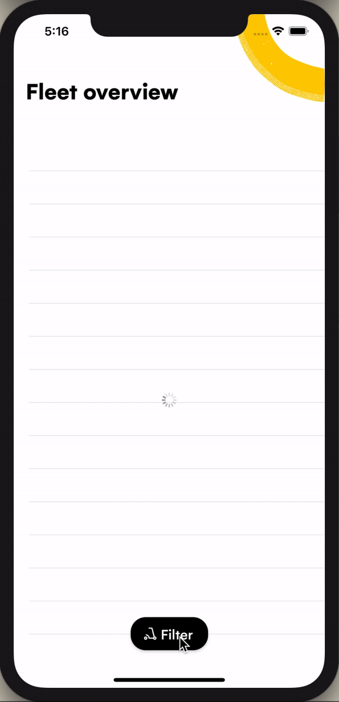
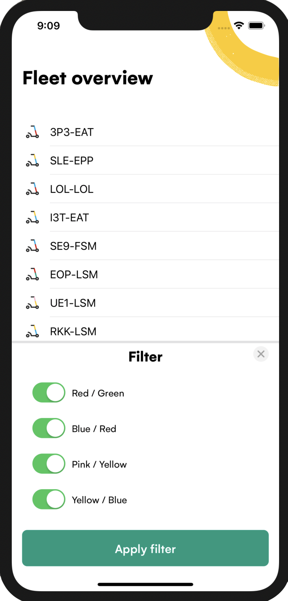
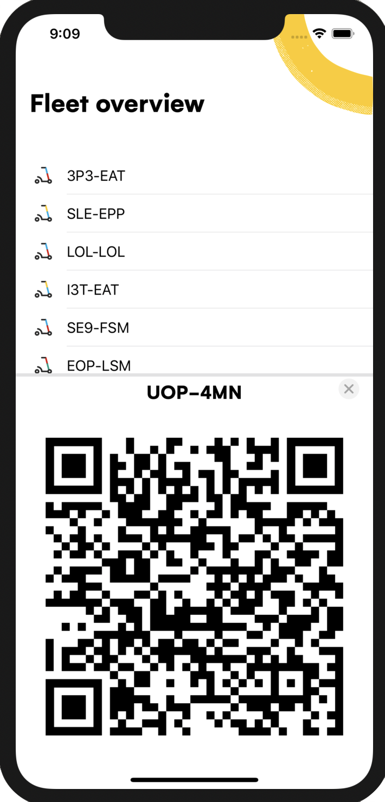

# Assignment instructions

First thing first, congrats on making it this far in the hiring process 🎉

## Tasks

At this stage of the hiring process, we would like to ask you to build an app that shows our available vehicles. Here are the user stories to implement:
 
### As a user:

1. I want to see the list of vehicles.

2. I want to be able to filter the vehicles by color.

3. I want the vehicle's color filter to be persisted between launches.

4. I want to know if the vehicle's list is filtered.

5. I want to see the vehicle's identification code and QR when I click on one.

6. I want to know when an error preventing me from seeing the list of vehicles has occured.

The end results should look as follows (Apart from the error presentation, feel free to show the error in anyway you see fit):



## Expectations

- We expect the outcome of the assignment to be production-ready code. This means that we expect the design of your architecture and solutions to withstand feature changes and additions, and be easy for other developers to contribute to.

- You can assume that all of the users speak the same language. This means that setting up app localization is not expected.

- There's no need to support dark mode.

- There's no need to support any accessibility feature.

## Provide tools

Meeting the outlined expectations might require spending quite some time. In order not to cause too much disturbance to your schedule, the following are provided to you:

- Configured XCode project.

- All of the UI components, layouts, and styling needed to achieve the above design.

- A framework (`AssignmentUtility.xcframework`) containing a class function that handles fetching the raw vehicles data:
```swift
/**
 Request the raw vehicles data.
    
 - This request simulates a server streaming RPC that sends raw vehicles data.
 - New raw vehicles data will be sent at a random interval between 1 to 20 seconds.
 - There's a 30% chance an error will be sent instead of the raw vehicles data.
     
 - Returns: The raw vehicles data.
 # Reference:
 [Server streaming gRPC](https://grpc.io/docs/what-is-grpc/core-concepts/#server-streaming-rpc)
*/
public static func requestVehiclesData() -> RxSwift.Observable<Data>
```

## Important note

If you prefer to implement the project from scratch, feel free to do so! You don’t even need to build the same UI shown above if you have a better design in mind. **Do whatever you think would show off your skills best as long as the tasks are achieved. However, you must use the provided `AssignmentUtility.xcframework` in order to get the raw vehicles data.**

## Bonus tasks

> Note that the bonus tasks are not required

Enjoyed the challenge and want more? Here are some tasks that we think you’ll find interesting:

### Enhance UX

We care deeply about the usability of our apps and there’s a clear flaw in the above design. You see, there is quite a lot of wasted screen real estate at the bottom of the flitters and QR screens. Because of this, the user needs to reach with his thumb all the way to the top of the screen to select the top filter to close the QR screen! Can you fix that by making the height of those screens fit the content? Basically, implement the following UI:

#### Filters screen



#### QR screen



### Enhance communication

As you can imagine, our apps require live data. The user would appreciate knowing when his internet connection will prevent him from receiving the experience we intend. Can you show a banner at the top of the screen when the vehicles API errors out due to a connection error explaining that there is an issue with the user's connection?

## FAQ

### 1. I see that the function to fetch the vehicles raw data returns an ‘Observable’. Am I required to use reactive programming and implement the tasks using RxSwift?

We mainly assess candidates based on there being a culture fit, their problem solving skills, design and critical thinking, and ability to learn and adopt new technologies and mindsets. With that in mind, using `RxSwift` to implement the assignment's tasks, although preferred, is not a requirement. However, the ability to use the function to fetch the vehicles raw data is. 

To learn enough about `RxSwift` to be able to use the provided function for fetching vehicles data, check out the following resources:

[Learn & Master ⚔️ the Basics of RxSwift in 10 Minutes](https://medium.com/ios-os-x-development/learn-and-master-%EF%B8%8F-the-basics-of-rxswift-in-10-minutes-818ea6e0a05b)

### 2. In the inline documentation of the function that fetches the vehicles raw data, it’s mentioned that the function is simulating a gRPC API, what is gRPC and why do you use it?

Well, you are in for a treat! In summary, gRPC is a way of communication between systems using Google's protocol buffers. It results in 7 to 10 times faster data transmission than REST APIs!

If you are inclined to know more, check out the [introduction docs](https://grpc.io/docs/what-is-grpc/introduction/).

_Happy learning! :)_

## Contact us

Finally, if you have any questions or feedback regarding the assignment, please don’t hesitate to reach out and email us at [ios-eng@ridedott.com](mailto:ios-eng@ridedott.com) we would love to hear your thoughts!

<br />

_Dott iOS team wishes you the best of luck!_
